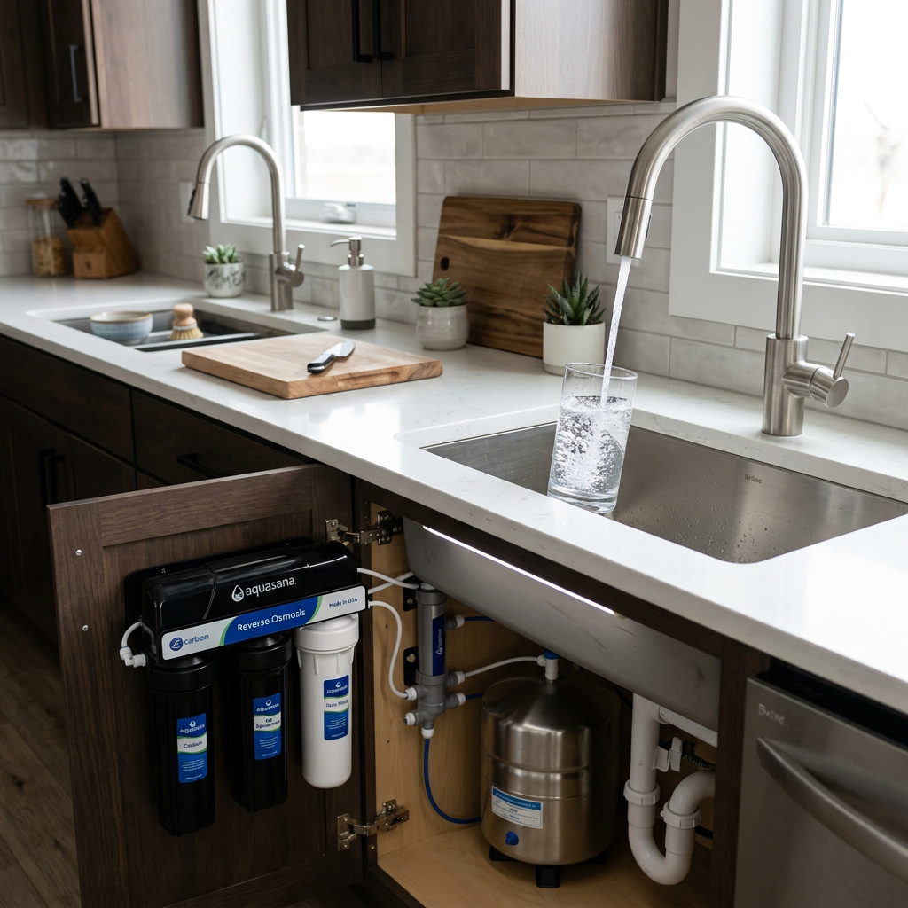
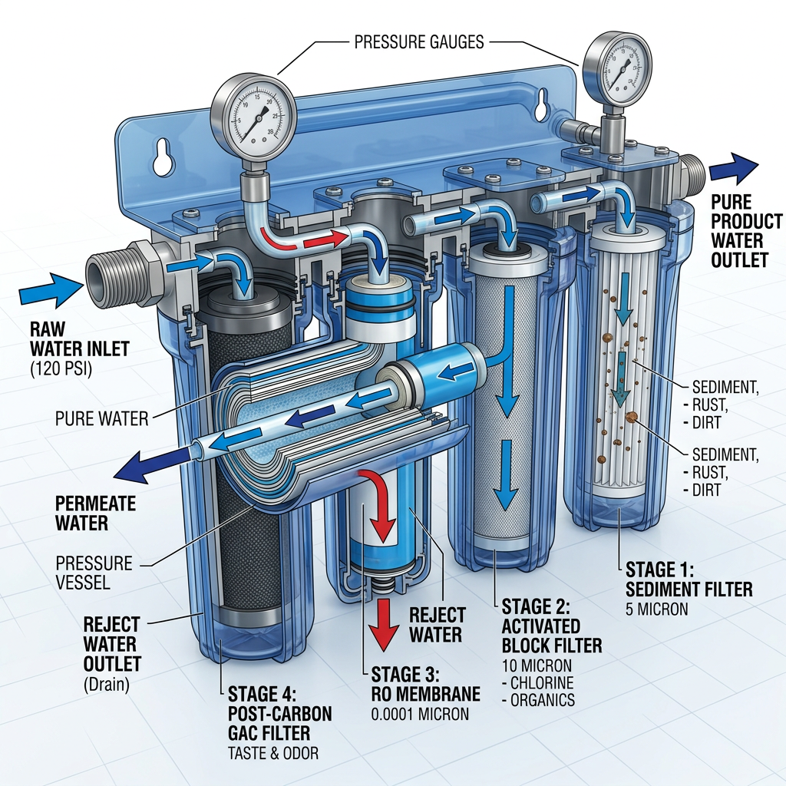
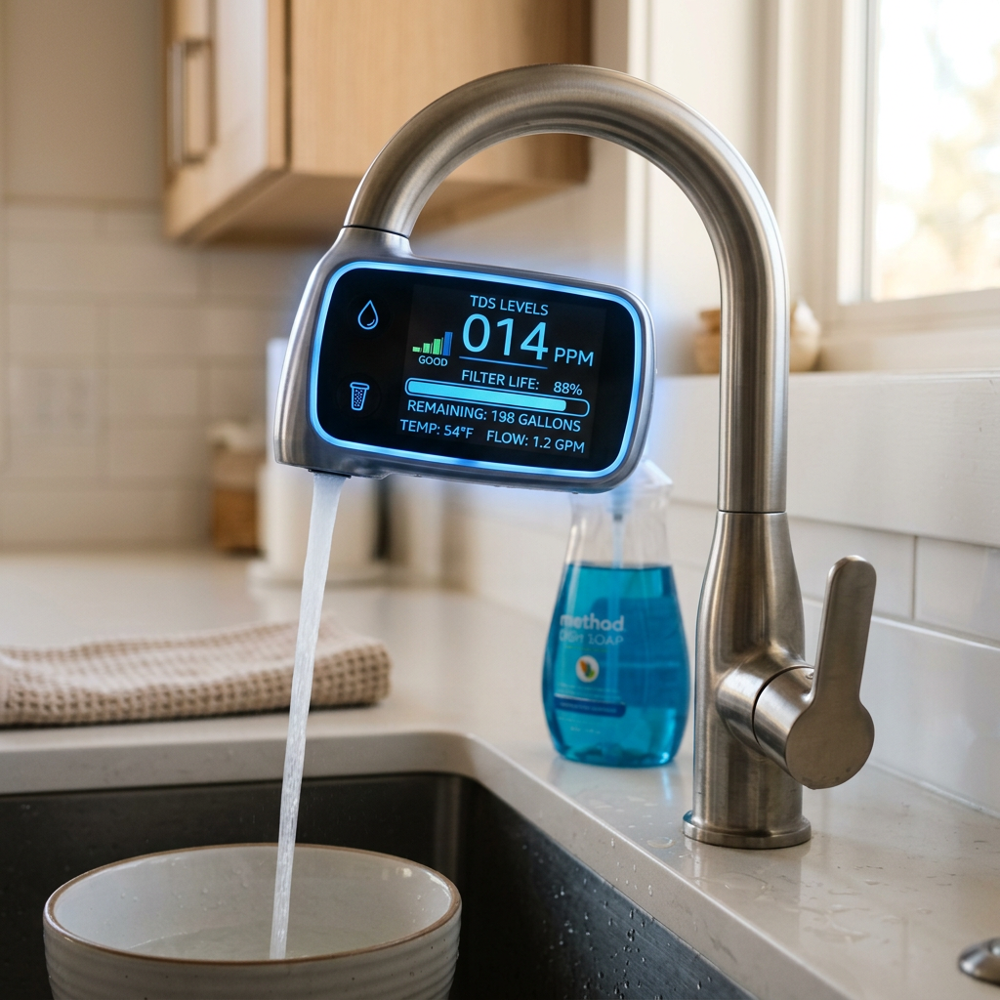
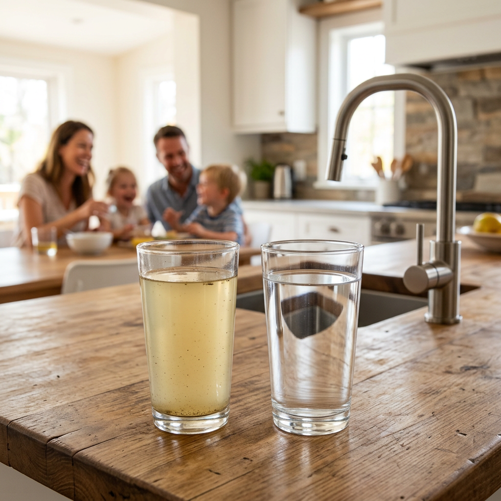

# Best Reverse Osmosis System 2026: The Ultimate Guide to Pure Drinking Water

<h2>Why You Need the Best Reverse Osmosis System 2026 Today</h2>
As we move into a new era of home wellness, the quality of our tap water has never been more scrutinized. Finding the <strong>best reverse osmosis system 2026</strong> is no longer just a luxury; it is a necessity for those concerned about emerging contaminants, microplastics, and heavy metals. The <strong>best reverse osmosis system 2026</strong> offers peace of mind by utilizing advanced semi-permeable membranes to strip away up to 99% of dissolved solids, ensuring every drop your family drinks is pure and refreshing.
<figure class="wp-block-image size-large"></figure>
When searching for the <strong>best reverse osmosis system 2026</strong>, consumers are shifting away from bulky, traditional tank-based units. The trend for 2026 focuses on space-saving, tankless designs that provide on-demand filtration without the risk of secondary pollution. This evolution in technology is why identifying the <strong>best reverse osmosis system 2026</strong> requires looking at flow rates, filtration stages, and smart monitoring capabilities.
<h3>Key Features of the Best Reverse Osmosis System 2026</h3>
To be considered the <strong>best reverse osmosis system 2026</strong>, a unit must excel in several categories. First is the filtration efficiency. The <strong>best reverse osmosis system 2026</strong> should feature at least a 5-stage filtration process, including a high-quality RO membrane and a carbon block for taste enhancement. Secondly, the <strong>best reverse osmosis system 2026</strong> must be easy to maintain, with quick-change filters that don't require a plumber.
<a href="https://pboost.me/M121azM2?uid=seo" class="btn checkout-btn" target="_blank" rel="sponsored">Click here to check price</a>
Furthermore, the <strong>best reverse osmosis system 2026</strong> often includes remineralization. Since RO water can be slightly acidic, the <strong>best reverse osmosis system 2026</strong> adds back essential minerals like calcium and magnesium, providing a crisp, alkaline taste that rivals premium bottled water. If you are looking for the <strong>best reverse osmosis system 2026</strong>, prioritize models that offer a high GPD (Gallons Per Day) rating to ensure you never run out of water during peak hours.
<figure class="wp-block-image size-large"></figure><h2>Comparing the Best Reverse Osmosis System 2026 Models</h2>
Choosing the <strong>best reverse osmosis system 2026</strong> involves comparing the top contenders in the market. Below is a comparison table to help you identify which features matter most when selecting the <strong>best reverse osmosis system 2026</strong> for your specific household needs.
<table><thead><tr><th>Feature</th><th>Best Reverse Osmosis System 2026 (Top Pick)</th><th>Standard RO Systems</th></tr></thead><tbody><tr><td>Flow Rate (GPD)</td><td>800+ GPD</td><td>50 - 75 GPD</td></tr><tr><td>Wastewater Ratio</td><td>3:1 (Efficient)</td><td>1:3 (Wasteful)</td></tr><tr><td>Design</td><td>Tankless / Compact</td><td>Large Tank / Bulky</td></tr><tr><td>Installation Time</td><td>15 - 30 Minutes</td><td>2 - 3 Hours</td></tr><tr><td>Smart Monitoring</td><td>Real-time TDS & Filter Life</td><td>None</td></tr></tbody></table>
As shown in the table, the <strong>best reverse osmosis system 2026</strong> outperforms older models in every metric. The <strong>best reverse osmosis system 2026</strong> is designed for the modern lifestyle, where efficiency and intelligence are paramount. By choosing the <strong>best reverse osmosis system 2026</strong>, you reduce your environmental footprint by minimizing wastewater and eliminating the need for single-use plastic bottles.
<figure class="wp-block-image size-large"></figure><h3>Installation and Maintenance of the Best Reverse Osmosis System 2026</h3>
Many homeowners worry that the <strong>best reverse osmosis system 2026</strong> will be difficult to install. However, the <strong>best reverse osmosis system 2026</strong> usually features an integrated waterway design that minimizes leaks and simplifies the setup process. Most users can install the <strong>best reverse osmosis system 2026</strong> in under 30 minutes. Maintenance for the <strong>best reverse osmosis system 2026</strong> is equally simple, often involving a 'twist-and-pull' filter replacement that takes seconds.
<a href="https://pboost.me/M121azM2?uid=seo" class="btn checkout-btn" target="_blank" rel="sponsored">Click here to check price</a>
Investing in the <strong>best reverse osmosis system 2026</strong> also means lower long-term costs. While the initial investment for the <strong>best reverse osmosis system 2026</strong> might be higher than a simple pitcher filter, the cost per gallon is significantly lower. The <strong>best reverse osmosis system 2026</strong> provides thousands of gallons of pure water, making it the most cost-effective solution for healthy hydration.
<h2>Final Verdict: Selecting the Best Reverse Osmosis System 2026</h2>
In conclusion, finding the <strong>best reverse osmosis system 2026</strong> is about balancing performance, size, and smart features. The <strong>best reverse osmosis system 2026</strong> should provide high-speed filtration, a low waste-to-pure water ratio, and remineralization for the best taste. Don't settle for mediocre water quality when the <strong>best reverse osmosis system 2026</strong> is readily available to transform your home's tap water.

Whether you are a health enthusiast or just want better-tasting coffee, the <strong>best reverse osmosis system 2026</strong> is the answer. Take the step toward a healthier lifestyle today by choosing the <strong>best reverse osmosis system 2026</strong> that fits your budget and your kitchen. Remember, the <strong>best reverse osmosis system 2026</strong> is an investment in your family's future.
<figure class="wp-block-image size-large"></figure><a href="https://pboost.me/M121azM2?uid=seo" class="btn checkout-btn" target="_blank" rel="sponsored">Click here to check price</a>