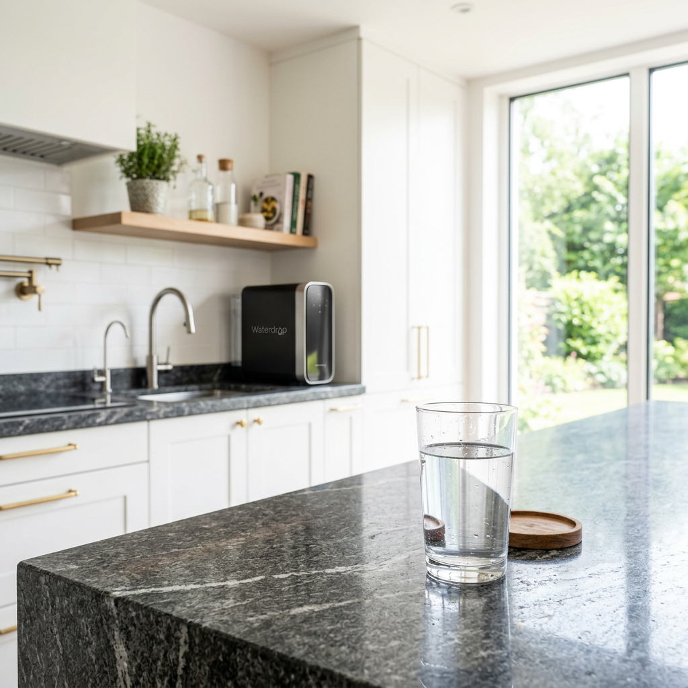
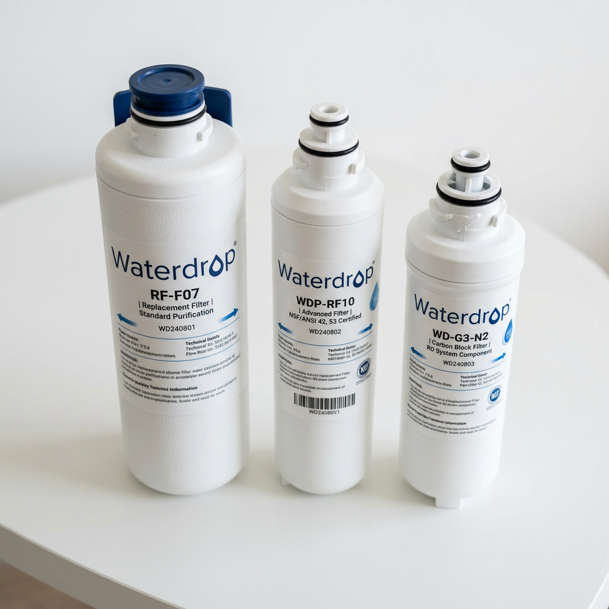
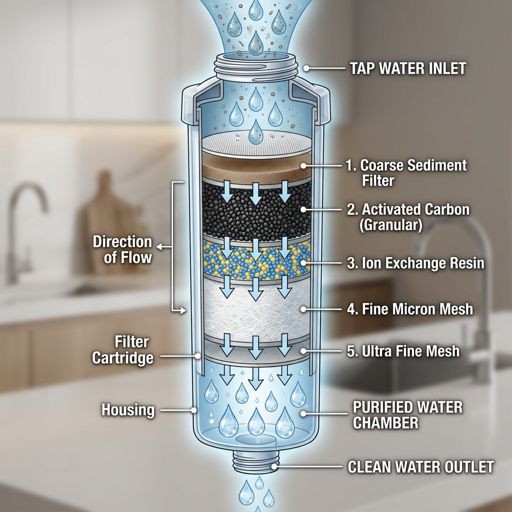

# Best Waterdrop Filter Replacement Guide: Keep Your Water Pure and Safe

<h2>Why Your Home Needs a Waterdrop Filter Replacement Today</h2>

Clean water is not just a luxury; it is a fundamental necessity for your health and well-being. If you are using a Waterdrop system, you already know the difference high-quality filtration makes. However, even the most advanced systems lose their effectiveness over time. That is where a high-quality <strong>waterdrop filter replacement</strong> becomes essential. Without a timely swap, your system may struggle to remove chlorine, heavy metals, and other contaminants that affect both taste and safety.

Choosing the right <strong>waterdrop filter replacement</strong> ensures that your Reverse Osmosis (RO) system or pitcher continues to provide crisp, refreshing water. In this guide, we will explore why maintaining your filtration cycle is the smartest investment you can make for your kitchen this year.

<figure class="wp-block-image size-large"></figure>

<h2>The Critical Benefits of Timely Waterdrop Filter Replacement</h2>

Many homeowners wait until their water tastes metallic or smells like chlorine before searching for a <strong>waterdrop filter replacement</strong>. By then, the internal carbon block or membrane has likely been saturated for weeks. Consistent <strong>waterdrop filter replacement</strong> offers several key advantages:

<ul>
    <li><strong>Contaminant Removal:</strong> Effectively reduces TDS (Total Dissolved Solids), fluoride, and arsenic.</li>
    <li><strong>Cost Efficiency:</strong> Replacing filters on time prevents sediment buildup that can damage your entire system.</li>
    <li><strong>Better Flavor:</strong> Ensures your coffee, tea, and home-cooked meals taste exactly as they should.</li>
</ul>

<a href="https://pboost.me/M121azM2?uid=seo" class="btn checkout-btn" target="_blank" rel="sponsored">Click here to check price</a>

<h2>Comparing Waterdrop Filter Replacement Options</h2>

Not all filters are created equal. Depending on your specific system, you might need a different <strong>waterdrop filter replacement</strong> model. Below is a comparison of the most popular options to help you decide which one fits your current setup.

<table>
    <thead>
        <tr>
            <th>Filter Type</th>
            <th>Lifespan</th>
            <th>Key Feature</th>
            <th>Best For</th>
        </tr>
    </thead>
    <tbody>
        <tr>
            <td>RO Membrane</td>
            <td>24 Months</td>
            <td>0.0001-micron filtration</td>
            <td>Ultimate Purity</td>
        </tr>
        <tr>
            <td>Carbon Block (CB)</td>
            <td>6-12 Months</td>
            <td>Chlorine & Odor Removal</td>
            <td>Improved Taste</td>
        </tr>
        <tr>
            <td>Sediment Filter</td>
            <td>6 Months</td>
            <td>Large Particle Removal</td>
            <td>System Protection</td>
        </tr>
    </tbody>
</table>

When you select your <strong>waterdrop filter replacement</strong>, always check the model number on your current unit to ensure 100% compatibility and leak-free performance.

<figure class="wp-block-image size-large"></figure>

<h2>How to Identify When You Need a Waterdrop Filter Replacement</h2>

Your system usually gives you signs when it is time for a <strong>waterdrop filter replacement</strong>. Most modern Waterdrop RO systems come equipped with a smart indicator light. If the light turns red, it is a clear signal that the filtration capacity has been reached. However, even without an indicator, you should consider a <strong>waterdrop filter replacement</strong> if you notice a decrease in water pressure or a change in the clarity of your ice cubes.

<h3>The Technology Behind Waterdrop Filter Replacement</h3>

The secret to the success of a <strong>waterdrop filter replacement</strong> lies in its multi-stage filtration technology. By utilizing advanced activated carbon and high-grade membranes, these replacements can capture microscopic impurities that standard filters miss. Investing in a genuine <strong>waterdrop filter replacement</strong> means you are getting a product tested against NSF/ANSI standards for material safety and structural integrity.

<figure class="wp-block-image size-large"></figure>

<h2>Step-by-Step Guide to Installing Your Waterdrop Filter Replacement</h2>

One of the best things about choosing a <strong>waterdrop filter replacement</strong> is the "twist-and-pull" design. You don't need a plumber or any special tools. Follow these simple steps:

<ol>
    <li>Turn off the water supply (if required for your specific model).</li>
    <li>Twist the old filter counter-clockwise and pull it out.</li>
    <li>Insert the new <strong>waterdrop filter replacement</strong> and twist it clockwise until it locks.</li>
    <li>Flush the system for 5-10 minutes to activate the new filter media.</li>
</ol>

By maintaining a regular schedule for your <strong>waterdrop filter replacement</strong>, you ensure that your system runs at peak efficiency for years to stay. Don't let a clogged filter compromise your hydration.

<a href="https://pboost.me/M121azM2?uid=seo" class="btn checkout-btn" target="_blank" rel="sponsored">Click here to check price</a>

<h2>Why Buying the Original Waterdrop Filter Replacement Matters</h2>

While generic brands may seem cheaper, only an authentic <strong>waterdrop filter replacement</strong> guarantees the precise fit required to prevent leaks and internal bypass. A bypass occurs when water flows around the filter rather than through it, meaning you are drinking unfiltered water despite having a new cartridge. Protect your family by sticking with a trusted <strong>waterdrop filter replacement</strong>.

In conclusion, if you haven't swapped your filter in the last six months, now is the perfect time. A fresh <strong>waterdrop filter replacement</strong> will restore your water pressure, improve your health, and give you peace of mind with every sip.

<figure class="wp-block-image size-large"></figure>

Ready to upgrade your water quality? Don't wait for the indicator light to turn red. Secure your <strong>waterdrop filter replacement</strong> today and enjoy the purest water possible.

<a href="https://pboost.me/M121azM2?uid=seo" class="btn checkout-btn" target="_blank" rel="sponsored">Click here to check price</a>